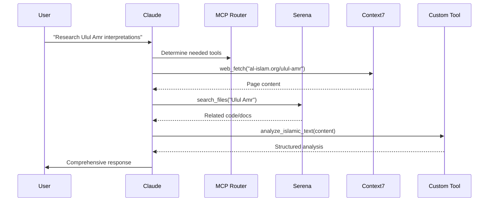

# Claude Docker Ecosystem Architecture (Continued)

## 🎭 Agent Orchestration Design

### 1. **Multi-Agent Architecture**

Claude Docker orchestrates multiple specialized agents:

```
Claude (Orchestrator)
    ├─> Serena Agent (Code Analysis)
    │   └─> Indexes and searches codebases
    ├─> Context7 Agent (Web Research)
    │   └─> Fetches and analyzes web content
    ├─> Twilio Agent (Notifications)
    │   └─> Sends SMS updates
    └─> Custom Agents (Your Tools)
        └─> Domain-specific capabilities
```

### 2. **Communication Flow**



### 3. **Tool Discovery & Selection**

Claude uses tool manifests to understand capabilities:

```json
{
  "tool_manifest": {
    "name": "islamic_scholar",
    "version": "1.0.0",
    "tools": [
      {
        "name": "analyze_isnad",
        "when_to_use": "When analyzing hadith authenticity",
        "capabilities": ["narrator_verification", "chain_analysis"],
        "cost": "low"
      },
      {
        "name": "cross_reference_tafsir",
        "when_to_use": "When comparing Quranic interpretations",
        "capabilities": ["multi_source_analysis", "scholarly_comparison"],
        "cost": "medium"
      }
    ]
  }
}
```

## 🔌 Extensibility Patterns

### 1. **Domain-Specific Extensions**

Create specialized MCP servers for your domain:

```python
# financial_analysis_mcp.py
class FinancialAnalysisMCP:
    tools = ["analyze_halal_investment", "zakat_calculator", "islamic_finance_advisor"]

# medical_ethics_mcp.py  
class MedicalEthicsMCP:
    tools = ["bioethics_analysis", "fatwa_search", "scholarly_consensus"]

# manuscript_analysis_mcp.py
class ManuscriptAnalysisMCP:
    tools = ["paleography_analysis", "text_dating", "scribal_identification"]
```

### 2. **Tool Composition**

Claude can compose multiple tools for complex tasks:

```python
async def complex_islamic_analysis(self, text):
    # Claude orchestrates multiple tools
    
    # Step 1: Extract entities
    entities = await self.call_tool("extract_islamic_entities", text)
    
    # Step 2: For each scholar mentioned, get their biography
    for scholar in entities["scholars"]:
        bio = await self.call_tool("get_scholar_biography", scholar)
        
    # Step 3: Cross-reference with manuscripts
    manuscripts = await self.call_tool("search_manuscripts", entities)
    
    # Step 4: Analyze relationships
    network = await self.call_tool("analyze_scholarly_network", entities)
    
    return self.synthesize_results(entities, bios, manuscripts, network)
```

### 3. **Workflow Automation**

Define reusable workflows:

```yaml
# workflows/hadith_verification.yaml
name: "Comprehensive Hadith Verification"
steps:
  - tool: "extract_hadith_text"
    input: "$user_input"
    output: "hadith_content"
    
  - tool: "analyze_isnad"
    input: "$hadith_content"
    output: "isnad_analysis"
    
  - tool: "search_hadith_collections"
    input: "$hadith_content"
    output: "collection_results"
    
  - tool: "verify_narrators"
    input: "$isnad_analysis.narrators"
    output: "narrator_verification"
    
  - tool: "generate_report"
    inputs: ["$isnad_analysis", "$collection_results", "$narrator_verification"]
    output: "final_report"
```

## 🏗️ Building Your Own Extensions

### Step 1: Define Your Tool's Purpose

```python
# quran_analysis_mcp.py
"""
MCP server for advanced Quranic analysis
- Verse cross-referencing
- Linguistic analysis (Arabic morphology)
- Thematic connections
- Historical context
"""
```

### Step 2: Implement MCP Protocol

```python
class QuranAnalysisMCP:
    def __init__(self):
        self.tools = self.register_tools()
        
    def register_tools(self):
        return [
            {
                "name": "analyze_verse_morphology",
                "description": "Analyze Arabic morphology of Quranic verses",
                "parameters": {
                    "verse_reference": "string",
                    "include_root_analysis": "boolean"
                }
            },
            {
                "name": "find_thematic_connections",
                "description": "Find verses with similar themes",
                "parameters": {
                    "theme": "string",
                    "search_scope": "enum[quran, surah, juz]"
                }
            }
        ]
```

### Step 3: Integration Points

```json
// .mcp.json
{
  "servers": {
    "quran-analysis": {
      "type": "stdio",
      "command": "python",
      "args": ["/workspace/mcp_servers/quran_analysis_mcp.py"],
      "env": {
        "QURAN_DB_PATH": "/data/quran.db",
        "MORPHOLOGY_MODEL": "/models/arabic_morphology.model"
      }
    }
  }
}
```

## 🔄 Real-World Use Cases

### 1. **Islamic Text Workflow Integration**

Your specific use case benefits from:
- **Graphiti Integration**: Knowledge graph construction
- **MCP Tools**: Enhanced analysis capabilities
- **Extensibility**: Add domain-specific tools

### 2. **Research Assistant**

```
User: "Compare interpretations of Ulul Amr across different schools"

Claude orchestrates:
1. Context7 → Fetch from multiple Islamic websites
2. Serena → Search local scholarly papers
3. Custom Tool → Extract and compare interpretations
4. Graphiti → Store relationships in knowledge graph
```

### 3. **Manuscript Digitization Pipeline**

```
User: "Process this manuscript image and extract entities"

Claude orchestrates:
1. OCR Tool → Extract text from image
2. Language Tool → Identify Arabic/Persian/Ottoman text
3. Entity Extractor → Find scholars, dates, places
4. Graphiti → Build temporal knowledge graph
```

## 🎯 Key Design Principles

1. **Modularity**: Each tool does one thing well
2. **Composability**: Tools can be combined for complex tasks
3. **Discoverability**: Claude learns tool capabilities from manifests
4. **Extensibility**: Easy to add new tools without modifying core
5. **Interoperability**: Standard protocols (stdio, JSON-RPC)

## 🚀 Future Possibilities

### 1. **Tool Marketplace**
- Share MCP tools with community
- Import specialized tools for your domain

### 2. **Visual Workflow Builder**
- Drag-and-drop tool composition
- Save and share workflows

### 3. **Multi-Modal Tools**
- Image analysis for manuscripts
- Audio processing for recitations
- Video analysis for lectures

### 4. **Distributed Execution**
- Tools running on different machines
- Cloud-based tool hosting
- Federated tool networks

The Claude Docker ecosystem is designed to grow with your needs, allowing you to build increasingly sophisticated AI-powered workflows while maintaining clean separation of concerns.