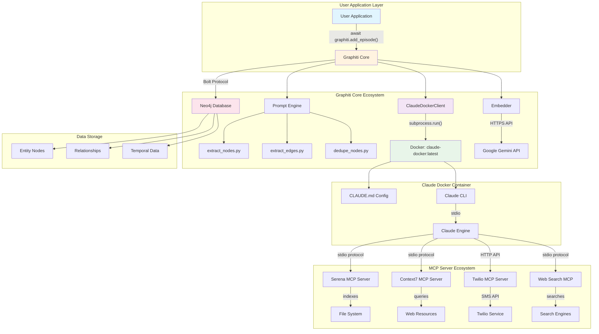

# Ecosystem Visualization: Graphiti + Claude Docker + MCP Servers

## 🌐 Complete System Architecture



## 🔄 Data Flow for Islamic Text Analysis

### 1. **User Initiates Analysis**
```python
# User code
await graphiti.add_episode(
    name="Ulul Amr Analysis",
    episode_body="In Quran 4:59, Allah commands obedience to Ulul Amr...",
    reference_time=datetime.now()
)
```

### 2. **Graphiti Processes Request**
```
Graphiti Core
    ├─> Generates extraction prompt (extract_nodes.py)
    ├─> Adds tool definitions for structured output
    └─> Calls ClaudeDockerClient._generate_response_with_tools()
```

### 3. **Claude Docker Execution**
```bash
# ClaudeDockerClient executes:
docker run --rm -i \
    -v /Users/farieds/.claude-docker:/home/claude-user/.claude \
    claude-docker:latest \
    claude --print --model sonnet
```

### 4. **Inside Claude Docker Container**
```
Claude Engine (with CLAUDE.md config)
    ├─> Recognizes entity extraction request
    ├─> Processes Islamic text
    ├─> May use MCP tools:
    │   ├─> Serena: Search codebase for related texts
    │   ├─> Context7: Look up Islamic references
    │   ├─> Web Search: Find scholarly sources
    │   └─> Twilio: Send completion notification
    └─> Returns structured JSON with entities
```

### 5. **Response Processing**
```json
{
  "entities": [
    {"name": "Ulul Amr", "type": "CONCEPT", "attributes": {...}},
    {"name": "Quran 4:59", "type": "VERSE", "attributes": {...}},
    {"name": "Allah", "type": "DEITY", "attributes": {...}}
  ],
  "relationships": [
    {"source": "Allah", "target": "Ulul Amr", "type": "COMMANDS_OBEDIENCE_TO"}
  ]
}
```

### 6. **Graph Storage**
```
Graphiti Core
    ├─> Validates extracted entities
    ├─> Creates embeddings via Gemini
    ├─> Deduplicates similar entities
    └─> Stores in Neo4j:
        ├─> CREATE (n:Entity:CONCEPT {name: "Ulul Amr"})
        ├─> CREATE (v:Entity:VERSE {name: "Quran 4:59"})
        └─> CREATE (a)-[r:COMMANDS_OBEDIENCE_TO]->(u)
```

## 🔌 Communication Protocols

### Internal Protocols by Layer:

| Layer | Protocol | Example |
|-------|----------|---------|
| **User → Graphiti** | Python API | `await graphiti.add_episode()` |
| **Graphiti → Claude Docker** | Subprocess | `subprocess.run(['docker', 'run', ...])` |
| **Graphiti → Neo4j** | Bolt | `bolt://localhost:7687` |
| **Graphiti → Gemini** | HTTPS REST | `POST https://generativelanguage.googleapis.com` |
| **Claude → MCP Servers** | stdio/JSON-RPC | `{"method": "search", "params": {...}}` |
| **MCP → External Services** | Various | HTTP, filesystem, APIs |

## 🎭 Active Agents and Their Roles

### 1. **Graphiti Core Agent**
- **Role**: Orchestrates knowledge graph construction
- **Capabilities**: Prompt generation, entity deduplication, graph operations
- **Communication**: Direct Python calls and subprocess execution

### 2. **Claude Docker Agent**
- **Role**: Natural language understanding and entity extraction
- **Capabilities**: Text analysis, structured output, tool use
- **Communication**: stdin/stdout with structured prompts

### 3. **MCP Server Agents** (within Claude Docker)
- **Serena**: Code and document indexing
- **Context7**: Web resource access
- **Twilio**: Notifications
- **Web Search**: Real-time information

### 4. **Embedder Agent** (Gemini)
- **Role**: Semantic understanding for search
- **Capabilities**: Text → Vector embeddings
- **Communication**: REST API

## 🔄 Example: Complete Ulul Amr Analysis Flow

```
1. User Input
   │
   ├─> "Analyze the concept of Ulul Amr from Tabataba'i's book"
   │
2. Graphiti Core
   │
   ├─> Prompt: "Extract entities from: [Islamic text about Ulul Amr]"
   ├─> Tools: [{"name": "extract_entities", "schema": {...}}]
   │
3. Claude Docker Container
   │
   ├─> CLAUDE.md: "Entity extraction mode activated"
   ├─> Claude processes text
   ├─> MCP Tools (optional):
   │   ├─> Context7: "Get info from al-islam.org/who-are-ulul-amr"
   │   └─> Serena: "Search for related Islamic texts"
   │
4. Structured Response
   │
   ├─> Entities: [Ulul Amr, Tabataba'i, Twelve Imams, ...]
   ├─> Relations: [interprets, references, disagrees_with, ...]
   │
5. Embedding Generation
   │
   ├─> Gemini: "Ulul Amr" → [0.23, -0.45, 0.67, ...]
   │
6. Neo4j Storage
   │
   └─> Graph: (Tabataba'i)-[:INTERPRETS]->(Ulul Amr)-[:REFERS_TO]->(Twelve Imams)
```

## 🚀 Key Insights

### What's Different About This Architecture:

1. **No Intermediate API Server**: Graphiti talks directly to Claude Docker via subprocess
2. **Preserved MCP Ecosystem**: Claude's internal agent orchestration remains intact
3. **Native Integration**: Claude Docker is a first-class LLM provider in Graphiti
4. **Separation of Concerns**: 
   - Graphiti handles graph logic
   - Claude handles NLP/extraction
   - MCP servers provide specialized capabilities
   - Neo4j handles persistence

### Benefits:

- **Performance**: No HTTP overhead between Graphiti and Claude
- **Simplicity**: Fewer moving parts, easier debugging
- **Flexibility**: Can use any MCP tools Claude has access to
- **Privacy**: All processing happens locally (except embeddings)

## 📊 Monitoring Points

### Where to Look for Issues:

1. **Graphiti Logs**: Python exceptions, graph operations
2. **Claude Docker Output**: `stdout` from docker run
3. **MCP Server Logs**: Individual tool execution
4. **Neo4j Browser**: Visual graph inspection
5. **Embedder Responses**: API rate limits or errors

### Health Checks:

```bash
# Neo4j
curl http://localhost:7474

# Claude Docker
docker run --rm claude-docker:latest claude --version

# Full Integration
python test_native_integration.py
```